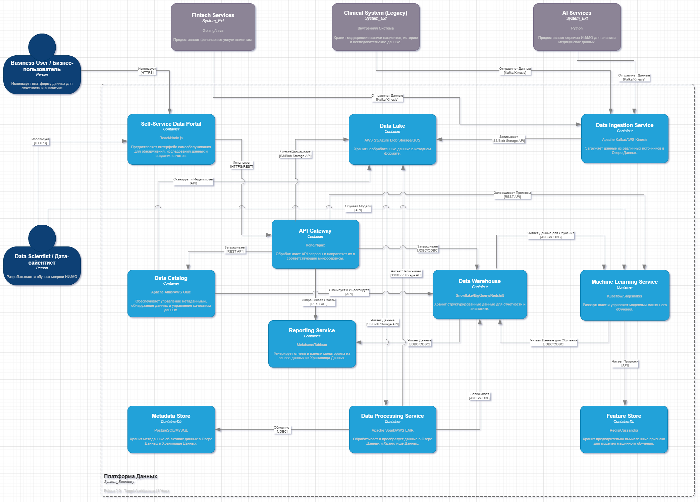

## Задание 1: Архитектура системы через год, диаграмма контейнеров, анализ проблем и их приоритизация

### 1. Диаграмма контейнеров C4:

На основе анализа текущей архитектуры и бизнес-целей "Будущее 2.0", предлагается следующая архитектура контейнеров на год вперед. Диаграмма включает в себя переход от монолитного DWH к более гибкой и масштабируемой Data Lakehouse архитектуре, а также выделение сервисов в микросервисы для большей независимости и отказоустойчивости.  

  

[Открыть / скачать диаграмму (Drawio)](C4_Context.drawio)  

**Описание компонентов:**

•   **Business User:** Бизнес-пользователи, использующие платформу данных для анализа данных, построения отчетов и принятия решений. Они взаимодействуют с платформой через Self-Service Data Portal, чтобы получать информацию по нужным срезам и создавать собственные отчеты, не прибегая к помощи технических специалистов. Это позволяет им оперативно реагировать на изменения рынка и принимать обоснованные решения.  
  
•   **Data Scientist:** Специалисты по анализу данных, создающие и обучающие модели машинного обучения. Они используют платформу данных для доступа к необходимым данным, экспериментам с моделями и развертывания обученных моделей через Machine Learning Service. Их работа позволяет автоматизировать бизнес-процессы, улучшить прогнозы и выявлять скрытые закономерности в данных.  
  
•   **Self-Service Data Portal (Web App):** Интерфейс для доступа к данным, создания отчетов, дашбордов и управления правами доступа. Основан на современных веб-технологиях (React/Node.js) и предоставляет интуитивно понятный интерфейс для бизнес-пользователей. Он позволяет им самостоятельно исследовать данные, создавать отчеты и дашборды, а также управлять правами доступа к данным, обеспечивая безопасность и соответствие требованиям.  
  
•   **API Gateway:** Точка входа для всех API-запросов к платформе данных, обеспечивает маршрутизацию, аутентификацию и авторизацию. Он скрывает сложность внутренней архитектуры платформы данных и предоставляет единую точку доступа для всех внешних и внутренних клиентов. API Gateway также может выполнять функции rate limiting, throttling и мониторинга API, обеспечивая стабильность и безопасность платформы.  
  
•   **Data Lake:** Хранилище данных в сыром формате (файлы, логи и т.д.). Используется для хранения всех данных, включая неструктурированные данные, поступающих из различных источников. Data Lake позволяет хранить данные в исходном формате, что упрощает процесс загрузки данных и обеспечивает гибкость в анализе данных. Он служит основой для Data Lakehouse архитектуры и обеспечивает доступ к данным для Data Processing Service и других компонентов платформы.  
  
•   **Data Warehouse:** Хранилище структурированных данных, оптимизированное для запросов аналитики и отчетности. Данные, обработанные и преобразованные Data Processing Service, загружаются в Data Warehouse для построения отчетов и дашбордов. Data Warehouse обеспечивает высокую производительность запросов и позволяет бизнес-пользователям быстро получать необходимую информацию для принятия решений.  
  
•   **Data Catalog:** Репозиторий метаданных, позволяющий искать, понимать и управлять данными в Data Lake и Data Warehouse. Он содержит информацию о структуре данных, их происхождении, качестве и правах доступа. Data Catalog позволяет бизнес-пользователям и дата-сайентистам легко находить нужные данные, понимать их значение и использовать их для анализа и принятия решений.  
  
•   **Data Ingestion Service:** Сервис для приема данных из различных источников, таких как клиническая система, финтех сервисы и AI-сервисы. Использует потоковые технологии (Apache Kafka, AWS Kinesis) для обеспечения надежной и масштабируемой загрузки данных. Data Ingestion Service позволяет быстро и легко добавлять новые источники данных в платформу, обеспечивая гибкость и масштабируемость.  
  
•   **Data Processing Service:** Сервис для обработки и трансформации данных, хранящихся в Data Lake, для загрузки в Data Warehouse. Использует Apache Spark для параллельной обработки больших объемов данных. Data Processing Service выполняет задачи по очистке данных, преобразованию данных, агрегации данных и обогащению данных, подготавливая данные для аналитики и отчетности.  
  
•   **Reporting Service:** Сервис для создания отчетов и дашбордов на основе данных в Data Warehouse. Использует современные инструменты визуализации данных (Metabase, Tableau) для предоставления информации в удобном и понятном виде. Reporting Service позволяет бизнес-пользователям быстро получать ответы на свои вопросы и принимать обоснованные решения.  
  
•   **Machine Learning Service:** Сервис для развертывания и управления моделями машинного обучения. Он позволяет дата-сайентистам быстро и легко развертывать обученные модели и предоставлять их в качестве сервисов для бизнес-пользователей. Machine Learning Service обеспечивает мониторинг производительности моделей и позволяет автоматически переобучать модели при необходимости.  
  
•   **Metadata Store:** База данных, хранящая метаданные о данных в Data Lake и Data Warehouse. Используется для хранения информации о структуре данных, их происхождении, качестве и правах доступа. Metadata Store является ключевым компонентом Data Catalog и обеспечивает возможность поиска, понимания и управления данными.  
  
•   **Feature Store:** Хранилище предварительно вычисленных признаков для моделей машинного обучения. Он позволяет дата-сайентистам быстро и легко получать доступ к необходимым признакам для обучения моделей. Feature Store обеспечивает консистентность признаков и позволяет повторно использовать признаки в различных моделях.  
  
•   **Clinical System (Legacy):** Существующая клиническая система (на базе SQL Server 2008) с медицинскими данными (истории болезней, результаты исследований). На текущий момент ее планируется оставить без изменений (кроме добавления Data Ingestion).  
  
•   **Fintech Services:** Существующие финтех-сервисы.  
  
•   **AI Services:** Существующие AI-сервисы.  
  
### 2.  **Проблемные места и их описание (для бизнеса):**

| №   | Проблема                                        | Описание проблемы для инженеров                                                                                                                                                                   | Описание проблемы для бизнеса                                                                                                                                                                                                                                |
| :--- | :---------------------------------------------- | :-------------------------------------------------------------------------------------------------------------------------------------------------------------------------------------------------- | :---------------------------------------------------------------------------------------------------------------------------------------------------------------------------------------------------------------------------------------------------------- |
| 1    | Устаревшее DWH на MS SQL Server 2008 с Power Builder | - Технологический долг, сложности с поддержкой и поиском специалистов. - Отсутствие горизонтальной масштабируемости, ограниченные возможности для интеграции с современными инструментами. - Power Builder - устаревший интерфейс, сложный в развитии и поддержке. | - Замедляет развитие: Из-за старой системы мы не можем быстро запускать новые продукты и сервисы. - Высокие риски: Устаревшая платформа подвержена сбоям и уязвимостям, что может привести к простоям или потере данных. - Дорогая поддержка: Нам сложно найти и дорого содержать специалистов, работающих с этой технологией. |
| 2    | Большое количество бизнес-логики в DWH         | - Жесткая связанность логики, сложности с изменением и тестированием. - Высокий риск побочных эффектов при модификации одной части. - Ограниченная переиспользуемость и масштабируемость отдельных логических блоков.  | - Медленный Time-to-Market: Любое изменение в бизнес-правилах или отчетах требует много времени и денег. - Риск ошибок: Изменение одной части логики может сломать другие, что приводит к неверным данным и потерям. - Сложность адаптации: Нам трудно быстро менять бизнес-процессы и отчетность под новые рыночные условия. |
| 3    | Сложность построения отчетов (часы ожидания, сотни ТБ) | - Проблемы с производительностью запросов из-за неоптимальной структуры данных, отсутствия индексов, недостаточной мощности DWH для аналитических нагрузок. - Невозможность использования распределенных вычислений для больших объемов данных. | - Невозможность оперативного принятия решений: Мы не можем быстро получать нужную информацию, что замедляет реакцию на изменения рынка и конкурентов. - Потеря эффективности: Сотрудники тратят часы на ожидание отчетов, вместо того чтобы заниматься полезной работой. - Ограничения в аналитике: Мы не можем проводить глубокий анализ данных из-за технических ограничений. |
| 4    | Много кастомизаций BI-системы поверх DWH        | - Высокая сложность поддержки многочисленных уникальных отчетов. - Отсутствие стандартизации и версионирования отчетов. - Проблемы с согласованностью данных между разными отчетами. - Зависимость от конкретных разработчиков, знающих специфику кастомизаций. | - Несогласованность данных: Разные отчеты могут показывать противоречивые данные, что подрывает доверие и затрудняет принятие решений. - Высокие затраты на поддержку: Каждый отчет уникален, его сложно менять и проверять, что дорого обходится. - Снижение гибкости: Трудно быстро адаптировать отчеты под меняющиеся потребности бизнеса. |
| 5    | Слой интеграций через старую шину данных (Apache Camel) | - Ограниченная масштабируемость для обработки больших объемов потоковых данных и высокой частоты событий. - Сложности с мониторингом и отслеживанием сквозных потоков данных. - Отсутствие нативной поддержки современных паттернов потоковой обработки данных. | - Задержки в данных: Данные между системами передаются медленно, что снижает актуальность информации. - Риск потери данных: Устаревшая шина может не справиться с нагрузкой, приводя к потерям или неконсистентности информации. - Сложность подключения новых систем: Интеграция каждого нового подразделения требует много ручной работы и времени. |
| 6    | Отсутствие единой картины по бизнес-показателям при независимом развитии направлений | - Разрозненные источники данных и отсутствие стандартизации. - Дублирование данных и логики обработки в разных системах. - Сложность создания кросс-доменных аналитических моделей и глобальных агрегаций.                                    | - Неполное видение бизнеса: Руководство не может получить целостное представление о состоянии всей компании, так как данные разрознены. - Неэффективное планирование: Сложно принимать стратегические решения без полной и достоверной картины. - Дублирование усилий: Разные отделы могут тратить ресурсы на сбор и обработку одних и тех же данных по-разному.      |

### 3.  **Приоритизация выявленных проблем (Метод MoSCoW)**

Мы используем метод MoSCoW для приоритизации проблем, что поможет сфокусироваться на наиболее критичных задачах для достижения целей проекта.  

•   **Must have (M):** Критически важные для достижения целей проекта, без них проект не имеет смысла.  
•   **Should have (S):** Важные, но не абсолютно критичные. Их отсутствие негативно повлияет, но проект все еще возможен.  
•   **Could have (C):** Желательные, но не обязательные. Повысят удобство или эффективность, но можно обойтись без них на начальном этапе.  
•   **Won't have (W):** То, что не будет реализовано в данном цикле.  

| №   | Проблема                                                                    | Приоритизация (MoSCoW) | Обоснование
|
| :--- | :-------------------------------------------------------------------------- | :---------------------- | :--------------------------------------------------------------------------------------------------------------------------------------------------------------------------------------------------------------------------------------------------------------------------------------------------------------------------------------------------------------------------------------------------------------------------------------------------------------------------------------------------------------------------------------- |
| 1    | Устаревшее DWH на MS SQL Server 2008 с Power Builder                        | Must have              | Это корень большинства проблем. Без замены или существенного обхода этой системы невозможно обеспечить требуемую масштабируемость, производительность и легкость интеграции новых бизнесов. Построение новой "витрины данных" напрямую зависит от возможности извлекать и обрабатывать данные вне этой устаревшей платформы.                                                                                                                                                                                                              |
| 2    | Сложность построения отчетов (часы ожидания, сотни ТБ)                       | Must have              | Прямо противоречит основной цели — создать "удобную витрину данных" с возможностью получать отчеты по любым срезам за разумное время. Если отчеты будут генерироваться часами, портал не будет восприниматься как "удобный" и не сможет обеспечить оперативность принятия бизнес-решений.                                                                                                                                                                                                                                           |
| 3    | Отсутствие единой картины по бизнес-показателям при независимом развитии направлений | Must have              | Это одна из ключевых бизнес-целей, заявленных руководством: "иметь единую картину по бизнес-показателям". Без решения этой проблемы, стратегическое управление диверсифицированной компанией будет затруднено, а интеграция новых бизнесов не принесет ожидаемых аналитических выгод. Новая архитектура должна способствовать формированию этого единого представления.                                                                                                                                                              |
| 4    | Большое количество бизнес-логики в DWH                                       | Should have             | Эта проблема является следствием устаревшего DWH и усугубляет проблемы с производительностью и гибкостью. Разгрузка DWH от этой логики и перенос ее в современные инструменты критически важен для обеспечения "интеграции новых бизнесов без дописывания огромного количества бизнес-логики". Хотя это может быть поэтапным процессом, его решение необходимо для достижения долгосрочных целей.                                                                                                                               |
| 5
| Слой интеграций через старую шину данных (Apache Camel)                      | Should have             | Важна для бесшовной интеграции новых систем и поддержки потоковой передачи данных, что является ключевым для современной аналитики. Можно начать с миграции наиболее критичных потоков на новую платформу (например, Apache Kafka), постепенно выводя из эксплуатации старую шину или используя ее только для специфических, не высокопроизводительных legacy-интеграций. Полная замена не обязательна в первый же день, но должна быть в плане.                                                                      |
| 6    | Много кастомизаций BI-системы поверх DWH                                    | Could have             | Появление новой "витрины данных" и стандартизированного семантического слоя автоматически решит многие из этих проблем. Многие кастомизации станут избыточными или будут переписаны в новой, более управляемой среде. Power BI может быть сохранен как инструмент визуализации, подключенный к новым витринам. Полная миграция и стандартизация всех существующих кастомизаций — это задача второго порядка, которая упростится после создания ядра платформы.                                                          |

### 4.  **Описание изменений в рамках трансформации:**

•   **Уход от монолитного DWH:** Переход к Data Lakehouse архитектуре. Это позволит отделить хранение сырых данных от хранилища для аналитики и отчетности.  Data Lakehouse позволит объединить преимущества Data Lake (гибкость, поддержка неструктурированных данных) и Data Warehouse (структурированные данные, производительность запросов).  
•   **Микросервисная архитектура:** Разбитие Data Platform на отдельные микросервисы. Каждый микросервис отвечает за свою задачу (прием данных, обработка, построение отчетов, и т.д.). Это позволит улучшить масштабируемость, отказоустойчивость и скорость разработки. Микросервисы позволят командам разрабатывать и развертывать компоненты платформы независимо друг от друга, что ускорит процесс разработки и повысит гибкость платформы.  
•   **Self-Service Data Portal:** Создание веб-интерфейса для бизнес-пользователей. Бизнес-пользователи смогут самостоятельно искать данные, создавать отчеты и дашборды. Этот портал предоставит возможность для бизнес-пользователей исследовать данные, создавать отчеты и визуализации без необходимости привлекать технических специалистов.  
•   **API Gateway:** Единая точка входа для всех API-запросов. Обеспечивает маршрутизацию, аутентификацию и авторизацию. Это упростит интеграцию с внешними системами и обеспечит безопасность платформы данных.  
•   **Data Catalog:** Централизованный репозиторий метаданных. Позволяет искать, понимать и управлять данными. Data Catalog позволит бизнес-пользователям и дата-сайентистам быстро находить нужные данные, понимать их структуру и происхождение, а также управлять качеством данных.  

### 5.  **Замечания:**

•   Данная архитектура является высокоуровневой. Для каждой компоненты необходимо провести детальный анализ и выбор конкретных технологий.  
•   Необходимо учитывать существующие навыки и опыт команды при выборе технологий.  
•   Необходимо разработать план миграции данных из существующего DWH в новую Data Lakehouse архитектуру.  
•   Сохранение Legacy Clinical System возможно только в краткосрочной перспективе. В долгосрочной перспективе необходимо рассмотреть возможность миграции данных в Data Lake и отказ от legacy системы.  