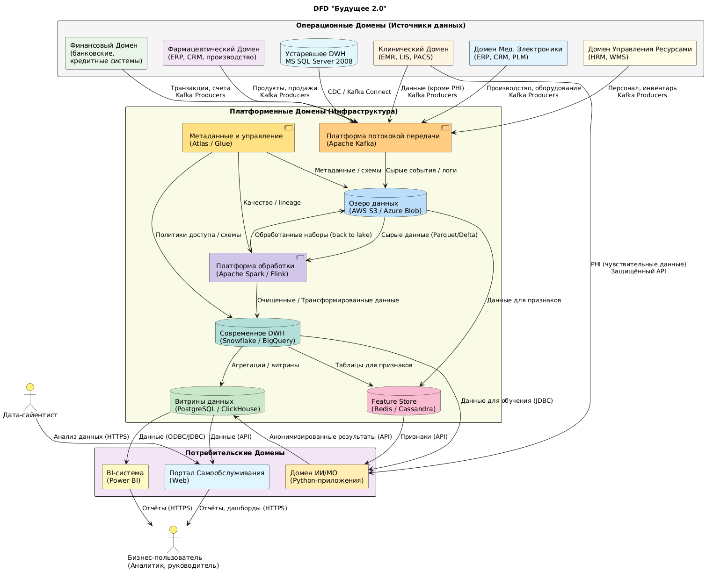

## Задание 2: Разделение системы на домены и Data Flow Diagram (DFD) - Обновленная версия

### 1. Разделение системы на домены

Система "Будущее 2.0" разделена на домены, основываясь на принципах Domain-Driven Design (DDD) и Data Mesh, для обеспечения независимого развития, масштабируемости и снижения нагрузки на устаревший DWH. Домены классифицируются на операционные (источники данных), платформенные (инфраструктура данных) и потребительские (доступ к данным).  

#### **Операционные Домены (Source Domains)**: 

Эти домены владеют данными в точках их создания.  

  •  **Клинический домен (Clinical Domain)**: Управление медицинскими клиниками, данные пациентов (демография, анамнез), истории болезни, результаты исследований (снимки, анализы). **Важно**: Чувствительные медицинские данные (PHI) остаются в этом домене и не должны напрямую попадать в общие аналитические витрины.  
  •  **Финансовый домен (Financial Domain)**: Банковские операции, счета, кредиты, транзакции, финансовая отчетность.  
  •  **Фармацевтический домен (Pharmaceutical Domain)**: Данные по производству, дистрибуции, продажам лекарственных препаратов (для интегрируемых компаний).  
  •  **Домен Мед. Электроники (Medical Electronics Domain)**: Данные по производству, продажам, обслуживанию медицинского оборудования (для интегрируемых компаний).  
  •  **Домен Управления Ресурсами (HR & Inventory Domain)**: Данные о персонале, инвентаризации, управлении активами больниц.  
  
#### **Платформенные Домены (Platform Domains)**: 

Предоставляют общую инфраструктуру для обработки, хранения и управления данными.  

  •  **Платформа Потоковой Передачи Данных (Event Streaming Platform)**: Центральный хаб для сбора данных в реальном времени из всех операционных доменов. **Реализация**: Apache Kafka.  
  •  **Озеро Данных (Data Lake)**: Хранилище сырых и частично обработанных данных из всех операционных доменов в исходном формате. **Реализация**: AWS S3, Azure Blob Storage, Google Cloud Storage.  
  •  **Платформа Обработки Данных (Data Processing Platform)**: Для выполнения ETL/ELT процессов, очистки, трансформации и агрегации данных. **Реализация**: Apache Spark, AWS EMR, Azure Databricks.  
  •  **Современное DWH (Modern Data Warehouse)**: Оптимизированное хранилище для структурированных и агрегированных данных, служащее основой для витрин данных. **Реализация**: Snowflake, Google BigQuery, Amazon Redshift.  
  •  **Домен Метаданных и Управления Данными (Metadata and Data Governance Domain)**: Управление метаданными, каталогизация, качество данных, отслеживание происхождения данных (data lineage) и применение политик доступа. **Реализация**: Apache Atlas, AWS Glue Data Catalog.  
  •  **Домен Feature Store (Feature Store Domain)**: Хранилище предварительно вычисленных признаков для моделей машинного обучения, обеспечивающее согласованность признаков между обучением и инференсом. **Реализация**: Feast, Tecton, Redis (для простых признаков).  

#### **Потребительские Домены (Consumption Domains)**: 

Предоставляют доступ к данным для аналитики и оперативных нужд.  

  •  **Домен ИИ/МО (AI/ML Domain)**: Использование данных для разработки, обучения и развертывания моделей машинного обучения для диагностики, прогнозирования и других задач. **Важно**: Доступ к чувствительным медицинским данным происходит напрямую из Клинического домена (или через безопасный канал) и не через общую аналитическую платформу.  
  •  **Домен Витрин Данных и Отчётности (Data Marts & Reporting Domain)**: Предоставляет оптимизированные наборы данных для конкретных бизнес-потребностей, часто в виде витрин данных.  
  •  **Домен Портала Самообслуживания (Self-Service Portal Domain)**: Пользовательский интерфейс для бизнес-пользователей для доступа к данным, создания ad-hoc отчетов и интерактивных дашбордов.  

### 2. Data Flow Diagram (DFD)

Диаграмма в формате Plant UML: [DFD: Потоки данных между доменами](DFD.puml)  

### 3. Описание доменов и потоков данных:

#### **Клинический домен (Clinical Domain)**:  
  •  Получает медицинские данные (кроме PHI) из Legacy Clinical System через Платформу Потоковой Передачи Данных (Kafka). PHI передается напрямую в Домен AI/ML через защищенный API.  
  •  Выполняет первичную обработку и очистку данных (кроме PHI).  
  •  Записывает обработанные данные (кроме PHI) в Озеро Данных (через Платформу Обработки Данных).  

#### **Финансовый домен (Financial Domain)**:  
  •  Получает финансовые данные из Fintech Services через Платформу Потоковой Передачи Данных (Kafka).  
  •  Выполняет первичную обработку и очистку данных.  
  •  Записывает обработанные данные в Озеро Данных (через Платформу Обработки Данных).  

#### **Домен AI/ML (AI/ML Domain)**:  
  •  Получает данные для обучения моделей из Озера Данных и Современного DWH (через Платформу Обработки Данных). PHI получает напрямую из Клинического Домена.  
  •  Разрабатывает, обучает и развертывает AI/ML модели.  
  •  Записывает агрегированные/анонимизированные результаты работы моделей в Витрины Данных (через Платформу Обработки Данных).  
  •  При необходимости, использует legacy AI Services (для поддержки старых моделей или переходного периода), но предпочтение отдается новым моделям, работающим с данными из новой платформы.  

#### **Платформа Данных (Data Platform)**: (Включает несколько под-доменов)  
  •  **Платформа Потоковой Передачи Данных (Kafka)**: Принимает потоковые данные из операционных доменов.  
  •  **Озеро Данных**: Хранит сырые и частично обработанные данные.  
  •  **Платформа Обработки Данных**: Предоставляет инструменты для ETL/ELT, очистки и трансформации данных.  
  •  **Современное DWH**: Хранит структурированные и агрегированные данные.  
  •  **Metadata and Data Governance**: Обеспечивает управление метаданными, каталогизацию и качество данных.  
  •  Предоставляет инфраструктуру для хранения, обработки и управления данными для Домена AI/ML и Домена Самообслуживания.  

#### **Домен Самообслуживания (Self-Service Domain)**:  
  •  Предоставляет Business User и Data Scientist интерфейс (Портал Самообслуживания) для доступа к данным, анализа и создания отчетов.  
  •  Получает данные из Витрин Данных (Data Marts).  
  •  Позволяет пользователям самостоятельно исследовать данные и строить ad-hoc отчеты и дашборды.  
  •  Data Scientists также используют портал для исследования данных и подготовки признаков для машинного обучения.  

### 4. Аргументация логики разделения на домены

#### 4.1 Логика разделения основана на следующих принципах:

•  **Bounded Contexts (DDD)**: Каждый домен имеет четко определенные границы и отвечает за свою часть бизнес-логики и данных.  
•  **Data Mesh**: Каждый домен рассматривается как "data product", которым владеет и управляет команда, обладающая знаниями об этой области.  
•  **Разделение ответственности (Separation of Concerns)**: Каждый домен отвечает за конкретную функцию, что упрощает разработку, тестирование и развертывание.  
•  **Data Sovereignty**: Операционные домены контролируют свои данные, обеспечивая соответствие нормативным требованиям (особенно важно для медицинских данных).  

#### 4.2 Аргументы в пользу конкретных доменов:

•  **Клинический домен**: Управление чувствительными медицинскими данными требует особого внимания к безопасности и соответствию нормативным требованиям (HIPAA, GDPR). Выделение этого домена позволяет реализовать строгие меры контроля доступа и шифрования.  
•  **Домен ИИ/МО**: Разделение этого домена позволяет использовать специализированные инструменты и инфраструктуру для машинного обучения, не затрагивая остальные части системы. Он также обеспечивает контролируемый доступ к медицинским данным для обучения моделей.  
•  **Платформа потоковой передачи данных**: Обеспечивает decoupling между операционными доменами и аналитической платформой, позволяя добавлять новые источники данных без изменения существующей инфраструктуры.  
•  **Data Lake**: Централизованное хранилище сырых данных, позволяющее проводить разнообразный анализ и эксперименты.  
•  **Современное DWH**: Оптимизированное хранилище для структурированных данных, обеспечивающее высокую производительность для отчетности и аналитики.  
•  **Metadata and Data Governance Domain**: Каталогизация и управление метаданными обеспечивают обнаруживаемость данных, контроль качества и соответствие политикам.  

### 5. Преимущества для компании

Разделение системы на домены предоставляет следующие преимущества:  

•  **Ускорение Time-to-Market**: Независимая разработка и развертывание доменов позволяют быстрее выпускать новые продукты и функции.  
•  **Гибкость и адаптивность**: Легкая интеграция новых бизнесов и технологий.  
•  **"Единая Картина по Бизнес-показателям"**: Централизованная платформа аналитики обеспечивает консолидированные отчеты и дашборды.  
•  **Масштабируемость и Производительность**: Современные технологии (Kafka, Spark, Snowflake) обеспечивают высокую производительность и масштабируемость.  
•  **Улучшенное Качество Данных и Доверие**: Четкое владение данными стимулирует поддержание их качества.  
•  **Усиленная Безопасность и Соответствие**: Изоляция чувствительных данных снижает риски утечек.  
•  **Снижение Технологического Долга и Операционных Рисков**: Постепенный вывод из эксплуатации устаревших систем.  
•  **Более эффективное использование AI/ML**: Оптимизированный доступ к данным для обучения и развертывания моделей машинного обучения.  
•  **Более довольные бизнес-пользователи**: Более удобный и быстрый доступ к данным для анализа и отчетности через портал самообслуживания.  

### 6. Связь с C4 Container Diagram (Задание #1)

Предлагаемое разделение на домены соответствует компонентам, представленным в контейнерной диаграмме. Например:  

•  **Data Lake, Data Warehouse, Data Catalog, Data Ingestion Service, Data Processing Service** – соответствуют платформенным доменам, обеспечивающим инфраструктуру данных.  
•  **Self-Service Data Portal** – соответствует домену портала самообслуживания, предоставляющему доступ к данным.  
•  **Внешние системы (Clinical System, Fintech Services, AI Services)** соответствуют операционным и потребительским доменам, поставляющим и использующим данные.  

### Заключение

Предложенное разделение на домены обеспечивает гибкую, масштабируемую и безопасную платформу данных для "Будущее 2.0", готовую к дальнейшему росту и инновациям. Оно позволяет компании эффективно использовать данные для принятия решений, разработки новых продуктов и улучшения качества обслуживания клиентов.