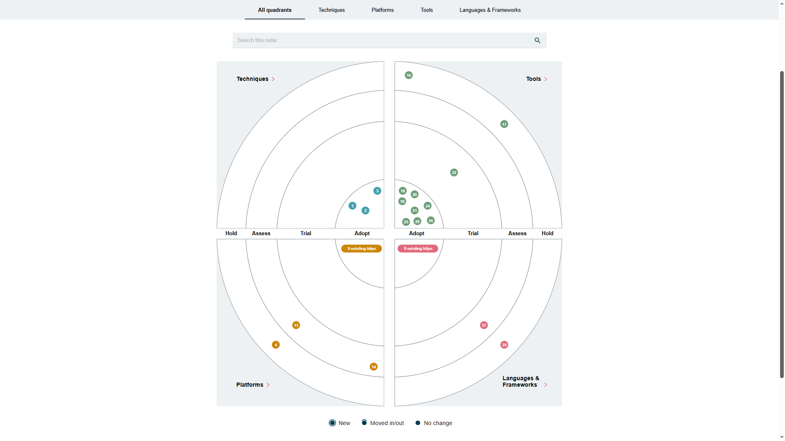
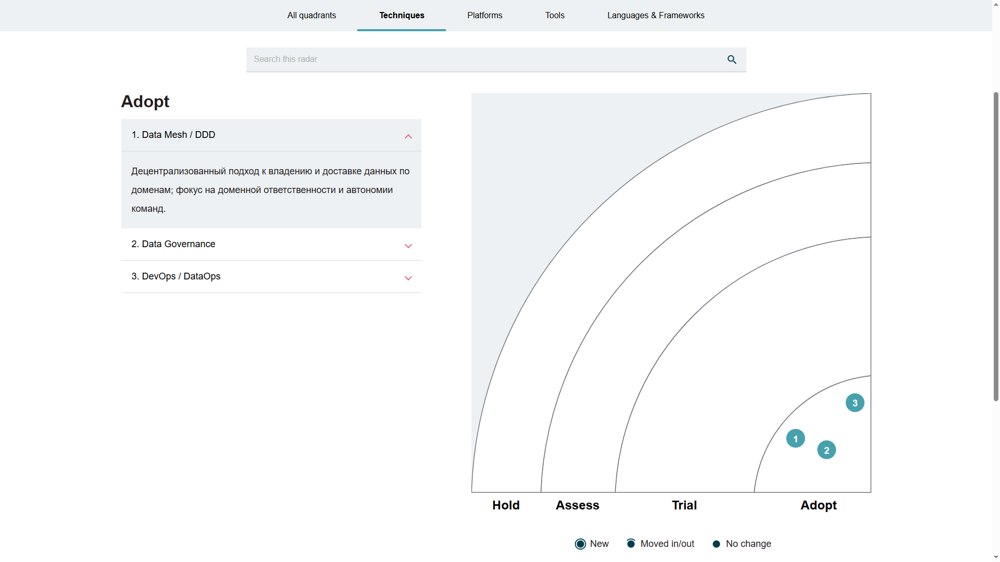
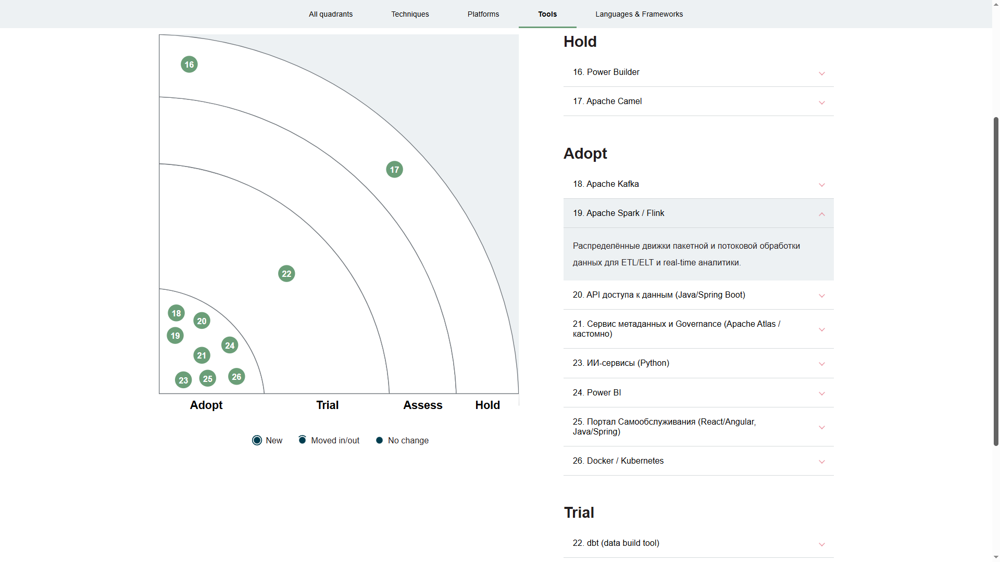
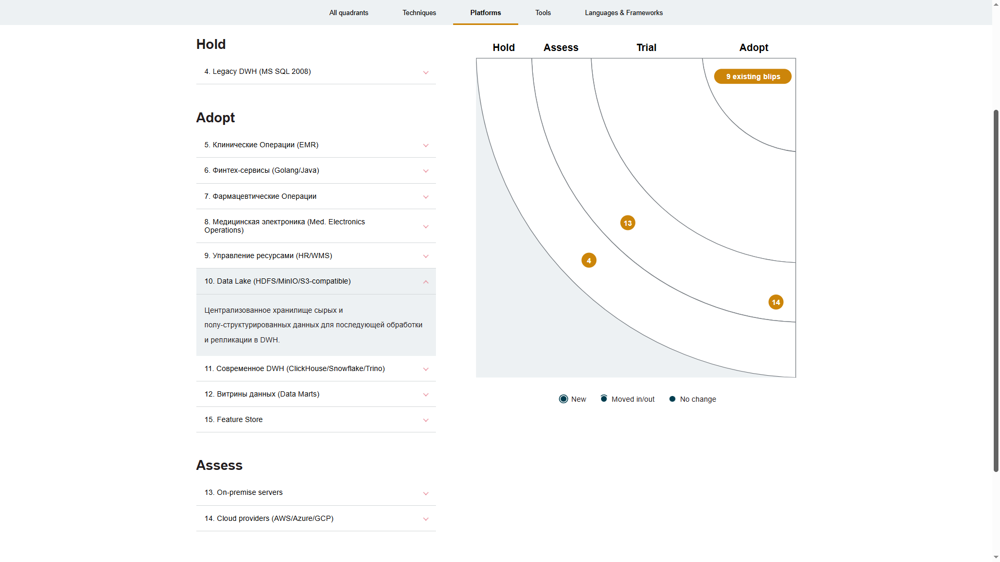
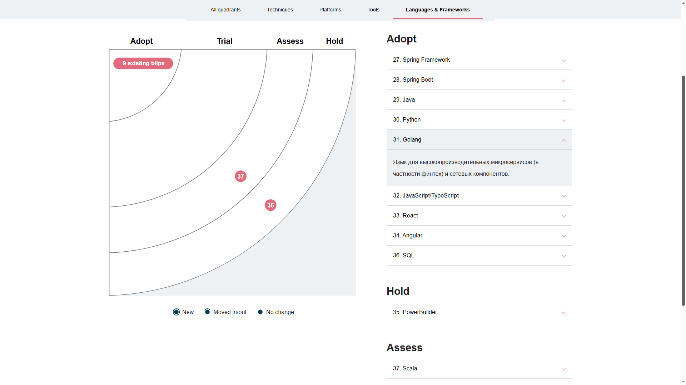
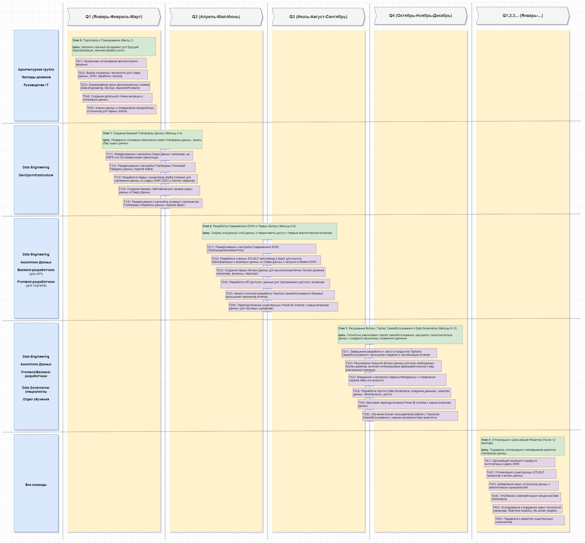

## Задание 3: Технический Радар и Роадмап трансформации

### 1. Технический Радар

Технический радар "Будущее 2.0" отражает текущее состояние технологий и методологий, а также предлагает целевые изменения, необходимые для достижения стратегических целей компании. Радар разделен на четыре квадранта:

•  **Техники (Techniques)**: Методы и подходы к разработке и эксплуатации.  
•  **Инструменты (Tools)**: Конкретное программное обеспечение и сервисы.  
•  **Платформы (Platforms)**: Базовые технологии для построения и развертывания.  
•  **Языки и Фреймворки (Languages & Frameworks)**: Языки программирования и библиотеки.  

Он представлен далее в табличном формате для ясности и детализации.

#### 1.1 Легенда для "Статуса:

•  **Внедрить (Adopt)**: Технологии, которые мы активно внедряем и используем в новой архитектуре.  
•  **Опробовать (Trial)**: Технологии, которые находятся на этапе пилотного внедрения или ограниченного использования, с целью оценки их пригодности для широкого применения.  
•  **Оценить (Assess)**: Технологии, которые мы изучаем для понимания их потенциальной пользы, но пока не начинали активного внедрения.  
•  **Удерживать (Hold)**: Технологии, которые являются устаревшими, не масштабируемыми и будут постепенно выводиться из эксплуатации или использоваться только в контексте Legacy-систем без дальнейшего развития.  

#### 1.2 Средства/инструментарий для построения:

Для построения Технического Радара применялся соответствующий инструментарий: см. https://radar.thoughtworks.com/  

Для построения необходимо загрузить файл в формате csv [Технический Радар в csv-формате](tech-radar.thoughtworks.csv), описывающий Технический Радар, передав соотвутствующую ссылку на файл репозитория github и нажав кнопку Build my radar.  

Соответствующий Технический Радар будет сформирован и доступен к просмотру.  

Отдельные представления Технического Радара далее:  

#### 1.3 Технический Радар "Будущее 2.0" (табличное представление)

| Категория                  | Технология / Методология            | Текущее Состояние (До изменений) | Целевое Состояние / Статус | Обоснование / Примечания                                                                |
| :------------------------------------------ | :---------------------------------------------- | :------------------------------- | :--------------------------- | :------------------------------------------------------------------------------------------------------------------------------------------------------- |
| 1. Операционные Домены (Источники)    | Legacy DWH (MS SQL 2008)           | Активное использование     | Удерживать (Hold)      | Подлежит постепенному выводу из активного аналитического контура. Источник исторических данных для миграции в новое DWH.                |
|                       | Power Builder                  | Активное использование     | Удерживать (Hold)      | Устаревший интерфейс, сложный в поддержке. Заменяется новым Порталом Самообслуживания.                                 |
|                       | Клинические Операции (EMR)            | Активное использование     | Использовать (Adopt)    | Основной источник чувствительных медицинских данных. Взаимодействует напрямую с ИИ-сервисами, минуя общую аналитическую платформу.           |
|                       | Финтех-сервисы (Golang/Java)          | Активное использование     | Использовать (Adopt)    | Источник финансовых транзакций, счетов. Передают данные в платформу потоковой передачи.                                   |
|                       | Фармацевтические Операции            | Частично/Новое          | Использовать (Adopt)    | Новые интегрируемые системы. Их данные будут собираться через платформу потоковой передачи.                                 |
|                       | Мед. Электроника Операции            | Частично/Новое          | Использовать (Adopt)    | Новые интегрируемые системы. Их данные будут собираться через платформу потоковой передачи.                                 |
|                       | Управление Ресурсами (HR/WMS)          | Активное использование     | Использовать (Adopt)    | Источник данных о персонале и инвентаризации. Передают данные в платформу потоковой передачи.                                  |
| 2. Платформа Интеграции         | Apache Camel                  | Активное использование     | Удерживать/Опробовать (Hold/Trial) | Заменяется Apache Kafka как основной шиной для потоковых данных. Возможно, останется для очень специфических Legacy-интеграций.               |
|                       | Apache Kafka                  | Отсутствует            | Внедрить (Adopt)      | Высокопроизводительная, масштабируемая платформа для потоковой передачи данных и интеграции в реальном времени (см. DFD).                |
| 3. Платформа Аналитики Данных     | Озеро Данных (Data Lake)             | Отсутствует            | Внедрить (Adopt)      | Централизованное хранилище сырых, полу-структурированных данных (на базе HDFS / MinIO / S3-совместимого).                          |
|                       | Apache Spark / Flink              | Отсутствует            | Внедрить (Adopt)      | Распределенная платформа для обработки больших данных (ETL/ELT, потоковая обработка).                                  |
|                       | Современное DWH                 | Отсутствует            | Внедрить (Adopt)      | Высокопроизводительное аналитическое хранилище (ClickHouse / Snowflake / Trino) для очищенных и структурированных данных.                    |
|                       | Витрины Данных (Data Marts)           | Частично/В составе BI       | Внедрить (Adopt)      | Оптимизированные и агрегированные наборы данных для конечных бизнес-пользователей.                                    |
|                       | API доступа к данным               | Отсутствует            | Внедрить (Adopt)      | Унифицированный и безопасный программный доступ к витринам данных (на Java/Spring Boot).                                |
|                       | Сервис Метаданных и Governance         | Отсутствует            | Внедрить (Adopt)      | Обеспечивает каталог данных, lineage (происхождение), качество и управление доступом (Apache Atlas или кастомное решение).                   |
|                       | dbt (data build tool)              | Отсутствует            | Trial            | Инструмент для трансформации данных в Data Warehouse. Позволяет автоматизировать и стандартизировать процессы трансформации.             |
| 4. Домены Потребления Данных      | ИИ-сервисы (Python)               | Активное использование     | Использовать (Adopt)    | Продолжат использоваться для диагностики, потребляя данные из Клинических Операций. Могут публиковать агрегированные результаты.                  |
|                       | Power BI                    | Активное использование     | Переподключить (Adopt)   | Сохраняется как BI-инструмент, но будет подключаться к новым, оптимизированным витринам данных.                              |
|                       | Портал Самообслуживания              | Отсутствует            | Внедрить (Adopt)      | Новый Web-интерфейс для бизнес-пользователей для создания и просмотра отчетов (React/Angular, Java/Spring). (см. диаграмму контейнеров)              |
| 5. Инфраструктура            | On-premise сервера                | Активное использование     | Опробовать/Оценить (Trial/Assess) | Рассматривается возможность частичной или полной миграции в облако (AWS/GCP/Azure) для гибкости и масштабирования.                        |
|                       | Docker / Kubernetes               | Отсутствует            | Внедрить (Adopt)      | Контейнеризация и оркестрация для микросервисов, гибкого развертывания и масштабирования. (см. диаграмму контейнеров)                     |
|                       | Yandex Cloud/AWS/Azure/GCP                  | Отсутствует            | Assess           | Облачные платформы. Предоставляют необходимую инфраструктуру для Data Platform.                                      |
| 6. Методологии и Принципы        | Монолитный подход                | Активное использование     | Data Mesh / DDD (Adopt)   | Децентрализованный подход к управлению данными, фокус на доменной ответственности. (см. Задание 2)                            |
|                       | Data Governance                 | Частично/Неформализовано     | Внедрить (Adopt)      | Формализация политик, процессов и ответственности за данные для обеспечения качества и безопасности.                            |
|                       | DevOps / DataOps                | Отсутствует            | Внедрить (Adopt)      | Автоматизация CI/CD для платформ данных, ускорение поставки решений.                                         |
| 7. Хранение признаков для ML      | Feature Store                  | Отсутствует            | Adopt            | Централизованное хранилище признаков для моделей машинного обучения, для обеспечения консистентности и переиспользования.                  |

### 2. Дорожная Карта (Roadmap)

Ниже представлена дорожная карта трансформации ИТ-ландшафта компании "Будущее 2.0" на ближайший год. Она охватывает ключевые этапы, ожидаемые результаты, ответственные команды и необходимые ресурсы.  

  

[Открыть / скачать диаграмму (Drawio)](Roadmap.drawio)  

### 3. Дорожная Карта Трансформации Данных "Будущее 2.0", этапы

**Горизонт**: 12 Месяцев  

#### **Этап 0**: Подготовка и Планирование (Месяц 1)  
**Цель**: Заложить прочный фундамент для будущей трансформации, минимизировать риски.  

**Основные Задачи**:  
•  Финальное согласование архитектурного решения.  
•  Выбор конкретных технологий для Озера Данных, DWH, обработки потоков.  
•  Формирование кросс-функциональных команд (Data Engineering, DevOps, Backend/Frontend).  
•  Создание детального плана миграции и интеграции данных.  
•  Анализ данных и определение приоритетных источников для первых этапов.  

**Ожидаемые Результаты**:  
•  Детальный план проекта, утвержденный стейкхолдерами.  
•  Выбранный технологический стек.  
•  Сформированные и обученные команды.  

**Ответственные Команды**: Архитектурная группа, Техлиды доменов, Руководство IT.  

**Необходимые Ресурсы**: Эксперты по Big Data, Cloud Architects, Проектные менеджеры, Бюджет на начальное ПО/облачные сервисы.  

#### **Этап 1**: Создание Базовой Платформы Данных (Месяцы 2-4)  
**Цель**: Развернуть ключевые компоненты новой платформы данных, начать сбор сырых данных.  

**Основные Задачи**:  
•  Развертывание и настройка Озера Данных (например, на HDFS или S3-совместимом хранилище).  
•  Развертывание и настройка Платформы Потоковой Передачи Данных (Apache Kafka).  
•  Разработка первых коннекторов (Kafka Connect) для извлечения данных из Legacy DWH (CDC) и Финтех-сервисов.  
•  Создание базовых пайплайнов для приема сырых данных в Озеро Данных.  
•  Развертывание и настройка основных компонентов Платформы Обработки Данных (Apache Spark).  

**Ожидаемые Результаты**:  
•  Функционирующее Озеро Данных.  
•  Функционирующая Платформа Потоковой Передачи Данных, принимающая данные из ключевых операционных систем.  
•  Базовые ETL/ELT процессы для сырых данных.  

**Ответственные Команды**: Data Engineering, DevOps/Infrastructure.  

**Необходимые Ресурсы**: Серверные мощности/облачные ресурсы, Лицензии на ПО (при необходимости), Эксперты по Kafka/Spark.  

#### **Этап 2**: Разработка Современного DWH и Первых Витрин (Месяцы 5-8)  
**Цель**: Создать очищенный слой данных и предоставить доступ к первым аналитическим витринам.  

**Основные Задачи**:  
•  Развертывание и настройка Современного DWH (ClickHouse/Snowflake/Trino).  
•  Разработка сложных ETL/ELT пайплайнов в Spark для очистки, трансформации и агрегации данных из Озера Данных и загрузки в Modern DWH.  
•  Создание первых Витрин Данных для высокоприоритетных бизнес-доменов (например, финансы, персонал).  
•  Разработка API доступа к данным для программного доступа к витринам.  
•  Начало пилотной разработки Портала Самообслуживания (базовый функционал просмотра отчетов).  
•  Переподключение существующих Power BI отчетов к новым витринам данных (для тестовых сценариев).  

**Ожидаемые Результаты**:  
•  Функционирующее Современное DWH с очищенными и структурированными данными.  
•  Доступные аналитические витрины для первых бизнес-доменов.  
•  Рабочий API доступа к данным.  
•  Прототип Портала Самообслуживания.  

**Ответственные Команды**: Data Engineering, Аналитики Данных, Backend-разработчики (для API), Frontend-разработчики (для портала).  

**Необходимые Ресурсы**: Лицензии DWH (если коммерческое), Дополнительные серверные/облачные мощности, Дизайнеры UI/UX для портала.  

#### **Этап 3**: Расширение Витрин, Портал Самообслуживания и Data Governance (Месяцы 9-12)  
**Цель**: Полностью реализовать портал самообслуживания, расширить покрытие витрин данных и внедрить механизмы управления данными.  

**Основные Задачи**:  
•  Завершение разработки и запуск в продуктив Портала Самообслуживания с функциями создания и кастомизации отчетов.  
•  Расширение покрытия Витрин Данных для всех необходимых бизнес-доменов, включая интегрируемые фармацевтические и мед. электронной компании.  
•  Внедрение и настройка Сервиса Метаданных и Управления (Apache Atlas или аналоги).  
•  Разработка политик Data Governance: владение данными, качество данных, безопасность, доступ.  
•  Массовое переподключение Power BI отчетов к новым витринам данных.  
•  Обучение бизнес-пользователей работе с Порталом Самообслуживания и новыми возможностями аналитики.  

**Ожидаемые Результаты**:  
•  Полностью функционирующий Портал Самообслуживания, активно используемый бизнес-пользователями.  
•  Комплексный набор витрин данных, охватывающий все бизнес-потребности.  
•  Внедренные процессы Data Governance и каталог данных.  
•  Единая картина по бизнес-показателям по всей компании.  

**Ответственные Команды**: Data Engineering, Аналитики Данных, Frontend/Backend-разработчики, Специалисты по Data Governance, Отдел обучения.  

**Необходимые Ресурсы**: Инструменты Data Governance, Бюджет на обучение, Ресурсы для поддержки пользователей.  

#### **Этап 4**: Оптимизация и Дальнейшее Развитие (После 12 месяцев)  
**Цель**: Поддержка, оптимизация и непрерывное развитие платформы данных.  

**Основные Задачи**:  
•  Дальнейшая миграция и вывод из эксплуатации Legacy DWH.  
•  Оптимизация существующих ETL/ELT процессов и витрин данных.  
•  Добавление новых источников данных и аналитических возможностей.  
•  Углубление и автоматизация процессов Data Governance.  
•  Исследование и внедрение новых технологий (например, Real-time Analytics, ML-driven Insights).  
•  Поддержка и развитие существующих компонентов.  

**Ожидаемые Результаты**:  
•  Полностью современная, масштабируемая и управляемая платформа данных.  
•  Непрерывное развитие аналитических возможностей компании.  

**Ответственные Команды**: Все команды.  

**Необходимые Ресурсы**: Постоянный бюджет на развитие и поддержку.  

### 4. Обоснование этапов дорожной карты

Каждый этап дорожной карты разработан для последовательного решения выявленных проблем, достижения поставленных бизнес-целей и минимизации рисков при переходе к новой архитектуре.  

#### **Этап 0**: Подготовка и Планирование: 

**Обоснование**: Это критически важный начальный шаг. Без четкого плана, согласованной архитектуры и правильно сформированных команд, любой крупный проект трансформации обречен на трудности. Выбор правильных технологий на старте позволяет избежать дорогостоящих переделок в будущем. Это минимизирует риски, связанные с неопределенностью и обеспечивает единство видения среди всех участников.  
  
#### **Этап 1**: Создание Базовой Платформы Данных: 

**Обоснование**: Фокус на создании фундамента платформы данных (Озеро Данных, Kafka, Spark) позволяет начать сбор данных из операционных систем, минуя устаревшее DWH. Это решает проблему неэффективной интеграции через старую шину данных и закладывает основу для масштабируемости и производительности. Сбор сырых данных в Озеро Данных обеспечивает гибкость для будущих аналитических потребностей и позволяет начать процесс разгрузки Legacy DWH.  
  
#### **Этап 2**: Разработка Современного DWH и Первых Витрин: 

**Обоснование**: На этом этапе данные из Озера Данных очищаются, трансформируются и структурируются в Современном DWH, а затем в специализированных Витринах Данных. Это напрямую решает проблему сложности построения отчетов и часов ожидания, предоставляя оптимизированные и быстрые источники данных. Разработка API доступа к данным начинает решать проблему отсутствия стандартизированного доступа и закладывает основу для Портала Самообслуживания, который является ключевой бизнес-целью. На этом этапе мы получаем первые конкретные результаты, видимые для бизнеса.  
  
#### **Этап 3**: Расширение Витрин, Портал Самообслуживания и Data Governance: 

**Обоснование**: Этот этап является кульминацией проекта. Запуск полноценного Портала Самообслуживания реализует главную бизнес-цель – удобную "витрину данных". Расширение покрытия витрин данных для всех доменов, включая новые приобретенные бизнесы, обеспечивает единую картину по бизнес-показателям при независимом развитии направлений. Внедрение Data Governance (метаданные, качество, доступ) решает проблему несогласованности данных и повышает доверие к информации, а также обеспечивает соответствие регуляторным требованиям. Это позволяет бизнес-пользователям самостоятельно получать отчеты, снижая нагрузку на ИТ-отдел.  
  
#### **Этап 4**: Оптимизация и Дальнейшее Развитие: 

**Обоснование**: Трансформация данных – это не одноразовый проект, а непрерывный процесс. Этот этап обеспечивает долгосрочную устойчивость и развитие платформы. Постепенный вывод из эксплуатации Legacy DWH и его компонентов окончательно устраняет технологический долг. Постоянная оптимизация и развитие гарантируют, что платформа будет адаптироваться к меняющимся потребностям бизнеса и новым технологиям, поддерживая конкурентное преимущество компании "Будущее 2.0".  

### Заключение:

Данное решение предоставляет детальный план трансформации "Будущее 2.0" на год вперед. Технический радар визуализирует текущее и целевое состояние технологий, а роадмап описывает конкретные шаги для достижения цели. Обоснование каждого этапа позволяет понять ценность трансформации для бизнеса.